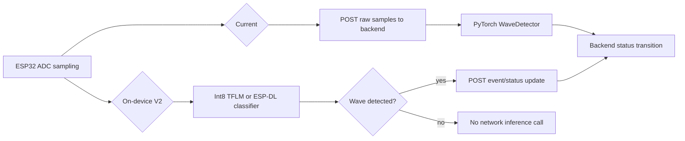

# Feasibility Report: Running Hazard Hero Inference on the ESP32

## Executive Summary

Running Hazard Hero inference directly on the ESP32 is **technically feasible**, but it is not the recommended path for the current pilot. The WaveDetector model is small enough to fit in flash and can likely fit in RAM **only if quantized to int8** and deployed through an embedded inference runtime such as TensorFlow Lite Micro or ESP-DL. Float32 inference is not realistic on the current ESP32-WROOM-32 target because WiFi and firmware memory pressure leave too little heap headroom. The safer recommendation is to keep backend inference for the pilot, then evaluate on-device inference as a V2 optimization for offline resilience and reduced network traffic.

## Direct Answer

**Yes, it is feasible to run inference on an ESP32, but only with an embedded deployment plan.** The existing PyTorch model should not be run directly; it would need conversion and quantization, most likely through PyTorch -> ONNX -> TFLite int8 for TensorFlow Lite Micro, or PyTorch -> ONNX -> ESP-PPQ -> ESP-DL. The current architecture should remain backend-based until the model input contract, normalization, and firmware integration are reconciled.

## Project-Specific Findings

The repository appears to have a mismatch between the originally described 512-sample, 25 ms input window and the active firmware/training configuration. The research subagent found active code and config using **200 samples at 20 ms**, while some docs/model comments still reference 512 samples.[^1] This matters because the embedded model export, tensor arena sizing, and representative quantization data all need to match the real firmware signal window.

The model architecture is favorable for embedded inference: three Conv1D-style blocks, BatchNorm, ReLU/MaxPool, AdaptiveAvgPool, then Linear/Sigmoid.[^2] BatchNorm can be folded into convolution weights during export, Dropout is removed at inference time, and AdaptiveAvgPool can map to a global average pool operation. The model is estimated around **35.8K parameters**, roughly **140 KB as float32 weights** or **35 KB as int8 weights**.[^3]

The current firmware is network-dependent: it samples ADC data, then calls the backend classification endpoint.[^4] Moving inference on-device would not eliminate the backend entirely; the device still needs to report a positive detection so the backend can transition sign status to `assistance_requested`.

## ESP32 Constraints

The active firmware target is ESP32-WROOM-32 with 4 MB flash and no PSRAM.[^5] ESP32 has limited internal RAM, and ESP-IDF documentation notes 520 KB SRAM total split across DRAM/IRAM, with 320 KB DRAM and a 160 KB static DRAM allocation limitation.[^6] With WiFi enabled, available heap is tight. That makes **float32 inference impractical** and **int8 inference the viable path**.

Estimated memory profile:

| Precision | Approx. weights | Approx. peak activations | Practicality |
|---|---:|---:|---|
| float32 | ~140 KB | ~50 KB | Too risky with WiFi active |
| int8 | ~35 KB | ~13 KB | Feasible but must be measured |

The model compute requirement is modest for a 240 MHz ESP32: around a few million MACs per inference for a 200-sample input. Since sampling itself takes about 4 seconds at 200 samples × 20 ms, a tens-of-milliseconds inference pass would not dominate end-to-end latency.

## Deployment Options

### Option A: TensorFlow Lite Micro int8

This is the recommended embedded ML path. TensorFlow Lite Micro supports ESP32-class targets, and the model operators can be represented using embedded-supported equivalents such as Conv/MaxPool/Mean/FullyConnected/Logistic.[^7] The likely workflow is:

1. Export PyTorch checkpoint to ONNX.
2. Convert ONNX to TensorFlow Lite.
3. Apply full int8 post-training quantization with representative ADC windows.
4. Embed the `.tflite` model as a C array in ESP-IDF firmware.
5. Add a static tensor arena and a `wave_classifier` wrapper.

Main risks are conversion friction, quantization accuracy loss, and tensor arena memory headroom with WiFi active.

### Option B: Espressif ESP-DL / ESP-NN

ESP-DL is also feasible and integrates naturally with ESP-IDF. It supports quantized inference and Espressif tooling, but ESP32 classic uses C operator implementations without the acceleration advantages of ESP32-S3.[^8] ESP-DL may be more attractive if the project moves to ESP32-S3 hardware.

### Option C: Edge Impulse

Edge Impulse could retrain and deploy a similar signal classifier as an ESP-IDF-compatible C++ library, with memory profiling and quantization handled by the platform.[^9] This is faster operationally but introduces vendor/platform dependency and may not preserve the exact existing checkpoint.

### Option D: DSP/heuristic detector

A non-neural detector is likely feasible and much lighter. Because the current synthetic positives are periodic sine/square-like waves, an on-device feature detector using variance, baseline removal, peak count, band energy, FFT, or autocorrelation could detect many gestures with far less memory than a CNN. Espressif’s ESP-DSP library supports optimized DSP primitives for ESP32-class devices.[^10] This would be the fastest embedded prototype, but it sacrifices the existing ML model’s learned behavior and confidence output.

## Architecture Impact

On-device inference would reduce raw telemetry uploads and improve local detection resilience, but it does not remove the need for backend connectivity to update staff-facing status. It also moves model rollout from backend deployment to firmware/OTA deployment, which is a significant operational tradeoff.

## Recommendation

For the **current pilot**, keep inference on the backend. The existing design is easier to debug, easier to update, and explicitly matches the pilot firmware scope found by the research subagent.[^11]

For **post-pilot V2**, prototype on-device inference with TensorFlow Lite Micro int8. Use a static tensor arena, measure heap before and after inference with WiFi connected, and compare int8 outputs against Python inference on identical ADC windows. If TFLM memory or conversion becomes costly, implement a DSP heuristic detector as a fallback or interim on-device classifier.

## Suggested V2 Implementation Plan

1. Reconcile the signal contract: confirm whether production input is 200 or 512 samples and update stale docs/model comments.
2. Confirm normalization uses ESP32’s 12-bit ADC range (`4095`) consistently in training, backend inference, and firmware.
3. Export the trained model to ONNX and convert to int8 TFLite using representative ADC windows.
4. Add an ESP-IDF `wave_classifier` module wrapping TensorFlow Lite Micro.
5. Replace the backend classify call in firmware with local inference, then POST only positive detection events.
6. Validate heap headroom, watchdog behavior, inference latency, and classification parity against Python.
7. Keep the backend classification endpoint as a debug and rollback path.

## Key Risks

| Risk | Severity | Mitigation |
|---|---|---|
| Runtime RAM exhaustion with WiFi active | High | int8 only, static tensor arena, heap instrumentation |
| Quantization accuracy loss | Medium | representative data, parity tests, possible QAT |
| Model/input mismatch | High | reconcile 200 vs 512 samples before export |
| Firmware update burden | Medium | keep backend classifier as fallback |
| Observability loss | Medium | upload positive events and optional sampled debug windows |
| ESP32 classic performance limitations | Low/Medium | prefer ESP32-S3 for future hardware |

## Confidence Assessment

**High confidence:** The model is small enough for flash, float32 inference is too risky on ESP32-WROOM-32, int8 is the correct deployment format, and backend inference should remain for the pilot.

**Medium confidence:** The exact heap headroom for int8 inference with WiFi active must be measured on hardware. Conversion from PyTorch to a microcontroller-ready int8 graph is standard but still needs validation against the exact model checkpoint and operator mapping.

**Assumptions:** The research assumes the active firmware target is ESP32-WROOM-32 without PSRAM, and that the active runtime input is 200 samples at 20 ms based on repository findings. If the deployed hardware is ESP32-S3 with PSRAM, feasibility improves materially.

## Footnotes

[^1]: Local repository findings reported by research subagent: `firmware/main/adc_sampler.h:10-11`, `config.json:4-7`, `ai/data.py:21-22`, `backend/app/routes/inference.py:23`, and stale references in `ai/model.py` / README docs.
[^2]: Local repository findings reported by research subagent: `ai/model.py:25-73`; `config.json:13-36`.
[^3]: Parameter and memory estimates calculated by research subagent from `ai/model.py` and `config.json` architecture.
[^4]: Local repository finding reported by research subagent: `firmware/main/main.c:309-320`, showing ADC batch collection followed by `https_client_classify(...)`.
[^5]: Local repository finding reported by research subagent: `firmware/sdkconfig.defaults:3`; `firmware/partitions.csv:4`.
[^6]: ESP-IDF Memory Types documentation: https://docs.espressif.com/projects/esp-idf/en/stable/esp32/api-guides/memory-types.html
[^7]: TensorFlow Lite Micro repository and documentation: https://github.com/tensorflow/tflite-micro and https://www.tensorflow.org/lite/microcontrollers/get_started_low_level
[^8]: ESP-DL overview and operator support: https://docs.espressif.com/projects/esp-dl/en/latest/introduction/readme.html and https://github.com/espressif/esp-dl/blob/master/operator_support_state.md
[^9]: Edge Impulse ESP32 documentation: https://docs.edgeimpulse.com/docs/edge-ai-hardware/mcu/espressif-esp32
[^10]: Espressif ESP-DSP library: https://github.com/espressif/esp-dsp
[^11]: Local repository finding reported by research subagent: `brownfield-specs/esp-idf-firmware-runtime/spec.md:91`, stating firmware does not run AI locally.
